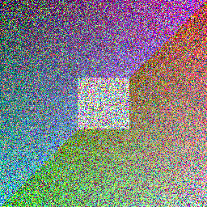
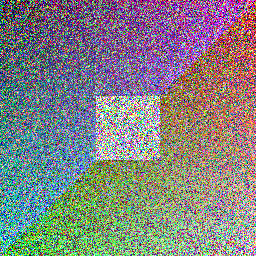

# decayfmt

[](https://github.com/aravpanwar/decayfmt/actions/workflows/ci.yml)
[](https://crates.io/crates/decayfmt)

_Featured in [This Week in Rust #660](https://this-week-in-rust.org/blog/2026/07/15/this-week-in-rust-660/)._

**A file format that corrupts itself a little every time you open it.** Every open
permanently damages the file on disk, by an amount baked into the filename, before it is
ever shown to you. There is no recovery from the file alone. The file is the only copy
that matters, and every read destroys a little more of it.


Two file types:

- `.idcy<x>` for images (example: `photo.idcy3`)
- `.tdcy<x>` for text (example: `note.tdcy7`)

`x` is a positive integer in the filename, the instability parameter. Higher `x` means
more corruption per open.

## Watch it decay

The grid above is one image encoded at `x=1`, `x=3`, `x=8`, and `x=15`, each opened the
same number of times. Same picture, four rates of decay. To follow a single instability
value across individual opens instead, each open corrupting the file further on disk
before it is ever shown, with no way back:

The clean original:


| Instability | After 1 open | After 3 opens |
| :---: | :---: | :---: |
| `x=3` (gentle) |  |  |
| `x=10` (severe) |  |  |

At `x=3` the image degrades gracefully over many opens. At `x=10` it is nearly gone after
one open and pure noise after three. `x` is the dial between a slow fade and near-instant
destruction.

Text decays the same way. A sentence encoded at `x=1` (a slow burn), printed after a few
opens:

```text
original : This sentence is dying, and every time you read it you kill it a little more.
 open 1  : This sgntence is d+ingd !nd every time you re&p it P~u kiKl it a little more}
 open 3  : This sgfxFn0e is d+ingd 3D6 every tibe you re&" it P~u kiKl it a 1ittl> m1re}
 open 6  : TIbm sgf}Fn0e ts d+iqgd yD6 ev*ry tibe you re&" )t Pnu kiKB )t aC1it"l> m1^e}
 open 9  : T/Sm sgf}Fk0- ts d|iqgd HD6 e@*rV tiFe you re&" )t Pnu kiKB )tpaC1it"lYMm1^>}
 open 12 : h/Sm hgf}Nk0-'ts?K|iqgd HD6 e@`~V}t&Fe y%u re&" )2 Pnu kiKB )6UaC1it1lYMm1]b!
```

Corruption only ever swaps in printable characters, so text garbles into readable-looking
nonsense rather than binary noise.

## What this is, and is not

decayfmt is a social contract enforced by math, not cryptography. It is not encryption,
not DRM, and not a secure deletion tool. The corruption is honest and unrecoverable from
the file alone, but anyone with a backup or a hex editor can defeat it. If you want the
original, keep a backup. If you do not want anyone to recover it, do not make one.

## Install

### With cargo

If you have a Rust toolchain, the quickest install is the published crate:

```
cargo install decayfmt
```

### From a release

Download the binary for your platform from the
[releases page](https://github.com/aravpanwar/decayfmt/releases) and put it on your PATH.
There is no runtime dependency to install.

On macOS the binary is unsigned, so the first run may be blocked by Gatekeeper. Right-click
it and choose Open, or clear the quarantine flag with `xattr -d com.apple.quarantine decayfmt`.

### From source

Requires a Rust toolchain.

```
cargo build --release
```

The binary is produced at `target/release/decayfmt`.

## Quickstart

See it decay in your terminal, with no image or sample file needed:

```
echo "this sentence is about to start dying" > note.txt
decayfmt encode --input note.txt --output note.tdcy8
decayfmt open note.tdcy8
```

The instability `x` comes from the output name (`note.tdcy8` decays at `x=8`). Run that last
line a few more times and watch the sentence rot further on each open. The corruption is
written to disk before it prints, so there is no way back. A high `x` like 8 garbles it
fast; a low `x` like 1 is a slow burn over many opens.

On Windows PowerShell the `>` redirect writes UTF-16, which decayfmt refuses; create the
file with `Set-Content note.txt "this sentence is about to start dying"` instead. cmd.exe
and PowerShell 7 are fine with the line above.

## Usage

### Encode

Turn a source image or text file into a decayfmt file. Encoding never corrupts; the new
file is clean.

```
decayfmt encode --input photo.png --output photo.idcy3
decayfmt encode --input note.txt  --output note.tdcy7
```

Both the file type and the instability `x` come from the output name: `idcy` for images and
`tdcy` for text, followed by `x` as a positive integer (`photo.idcy3` is an image at `x=3`).
An output name that could never be opened is refused rather than written. Images are decoded
to raw RGBA; text must be valid UTF-8.

### Open

Open a decayfmt file. This corrupts it in place on disk, then displays the result.
Images open in your system's default image viewer. Text prints to the terminal, and
when there is no terminal (for example when launched from a file manager) it also
opens in your default text editor.

```
decayfmt open photo.idcy3
decayfmt open note.tdcy7
```

`x` is read from the filename, so renaming the file changes how hard the next open hits.

## How the corruption works

On each open, a per-byte corruption probability is derived from `x`:

```
p = 1 - exp(-x / 10)
```

So `x = 1` corrupts roughly 9.5% of eligible bytes per open, `x = 5` roughly 39%, and
`x = 10` roughly 63%. The randomness comes from a cryptographically secure generator
seeded from operating system entropy, never from a fixed seed, so two opens of the same
state look different and the corruption sequence cannot be replayed.

- **Images:** the red, green, and blue channels are each corrupted independently with
  probability `p`. The alpha channel is never touched, so corruption shows as color
  noise rather than transparency holes.
- **Text:** each byte is replaced, with probability `p`, by a random printable ASCII
  byte. This operates on bytes, not characters, so at high `x` it can break UTF-8; the
  viewer renders what it can and substitutes the replacement character for the rest.
  Corruption substitutes bytes in place and never inserts or deletes, so the file length
  and the positions of untouched bytes are preserved: content decays but structure does
  not. The original byte length is always recoverable, and at low `x` word lengths and
  layout largely survive. Spaces are not protected; they are replaced at the same rate as
  any other byte and erode along with everything else as `x` rises.

## The contract

- Corruption is written to disk at open time, before display. A crash or kill after the
  write does not undo it. Opening always costs a corruption.
- A read-only file is refused with an error and never displayed. A free read would break
  the contract.
- The header is never changed after encoding. Only the payload decays.
- There is no state in the file: no read counter, no timestamp, no record of who opened
  it or when.
- There is no recovery mechanism of any kind.

## Limitations

- This is a social contract, not cryptography. A backup defeats it entirely.
- A determined person with a hex editor can tamper with the file.
- It is not a secure deletion tool and makes no cryptographic guarantee.
- Displaying a file writes the corrupted result to a temporary file for the system viewer.
  The most recent one persists until the next open sweeps it, or indefinitely if there is
  no next open, so a snapshot of the last-shown state stays recoverable until then.
- Two opens running at the same time can race: both read the same starting state, and the
  last write wins, so concurrent opens may cost fewer corruptions than sequential ones.
- v1 supports images and text only. No audio, video, or other binary formats.

## License

decayfmt is released under the MIT License. See [LICENSE](LICENSE).

---

[HN Discussion](https://news.ycombinator.com/item?id=49390206)
